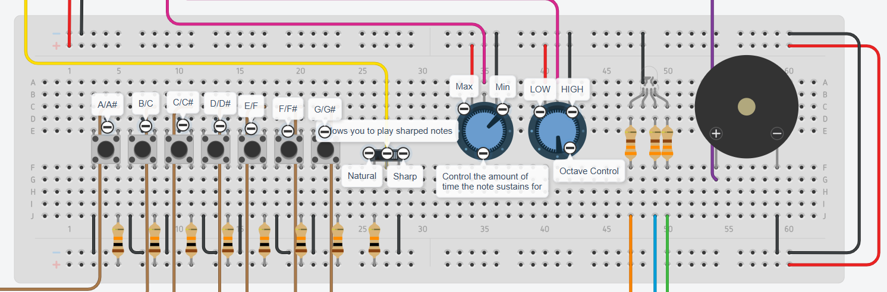
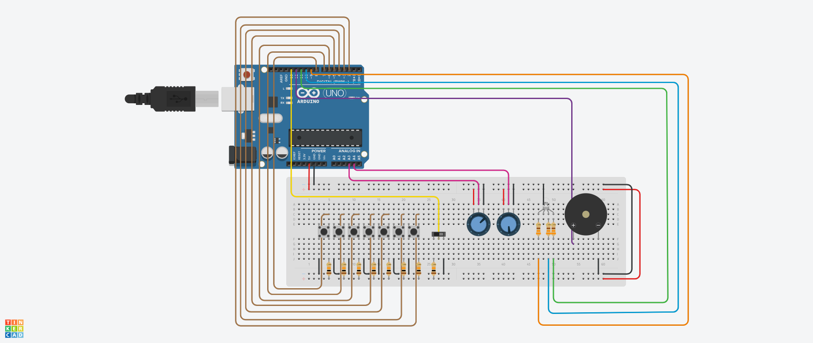

# Electric-Xylophone
This is a prototype of an electric xylophone that can be used to play music. It is an Arduino project built on Tinkercad. 

# Functionality
A button and piezo buzzer are used to play notes. Potentiometers and a switch are used to customize the notes that can be played.

When a button is pressed, the instrument will play and hold a specific note for a certain period of time. This amount of time can be specified using a potentiometer. The minimum amount of time that can be set is 500 milliseconds and the maximum amount of time that can be set is 5615 milliseconds. The rest of the values that can be set as the sustain time are between the two values. When a button is pressed or held down, the device will play the note once and will only play it for the specified period of time. This device can also only play one note at a time. A new note can only be played once the previous note stops playing. If one attempts to play multiple notes at a time, only the first note that is requested will be played. An indicator in the form of an LED shows when a note is done and the device is ready to play a new one. When the LED displays green, the device is ready for a new note, and when the LED displays any other colour, usually red, the device is currently playing a note. 

Despite there being only seven buttons that are used to play notes, both natural and sharp notes can be played on this xylophone. This is because there are two modes on this xylophone: natural mode, which plays natural notes, and sharp mode, which plays the sharp version of a note. When changing from natural mode to sharp mode, the note that corresponds to each button changes: A becomes A#, B becomes C, C becomes C#, D becomes D#, E becomes F, F becomes F#, and G becomes G#. When changing from sharp mode to natural mode, the values for each button also change: A# becomes A, C becomes B, C# becomes C, D# becomes D, F becomes E, F# becomes F, and G# becomes G.  To access either mode, one can flip the switch on the device. Notes of six different octaves can also be accessed using the device by turning a potentiometer. The potentiometer is divided into six parts which are indicated using dots. By turning the arrow on the potentiometer towards a specific section, notes in the octave that correspond to that section can be accessed.

A labeled diagram of the components used to play notes and control settings:

# Circuitry
The following are the electrical components that are required: Arduino UNO (x1), Breadboard (x1), Button (x7), Switch (x1), Potentiometer (x2), RGB LED (x1), 10 kilo ohm Resistor (x8), 330 ohm resistor (x3), Piezo Electric Buzzer (x1), Wires

Circuit diagram:

Circuit designed using Tinkercad
